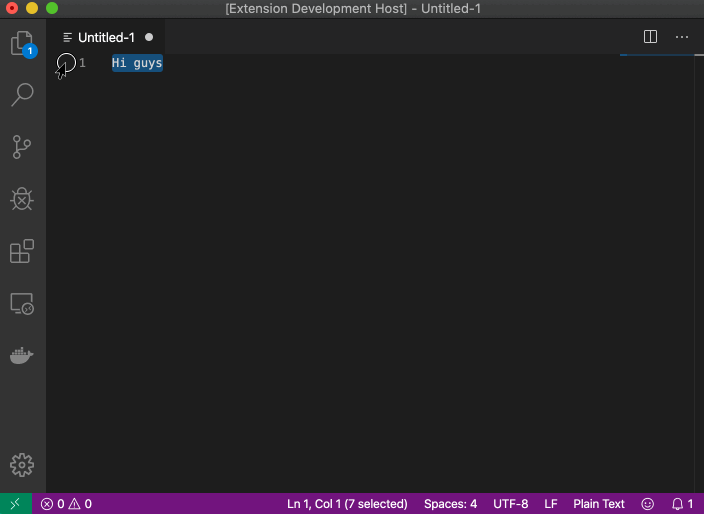

# みらい翻訳 for VS Code

Translate English text to Japanese using [みらい翻訳] (Mirai Translator) from VS Code.

> [みらい翻訳] （高精度な機械翻訳サービス）を使って英語のテキストを日本語に翻訳するための Visual Studio Code拡張機能です。

[みらい翻訳]: https://miraitranslate.com/trial/

## Features (機能)

- Translation English text you selected to Japanese using [みらい翻訳] by the command on Command Palette. The command title is `Translate from English to Japanese using Mirai Translator`.

> - 選択した範囲の英語を日本語に翻訳（選択した状態でコマンドパレットの`Translate from English to Japanese using Mirai Translator`を実行）

## Requirements (必要な環境)

Internet connection to [みらい翻訳].

> [みらい翻訳] のWebページに繋がるインターネット環境。

## Extension Settings (拡張機能の設定)

Nothing.

> なし。

## Known Issues (既知の問題)

See [issues](https://github.com/zawataki/vscode-mirai-translator/issues?q=is%3Aissue+is%3Aopen+label%3Abug).

> [issues](https://github.com/zawataki/vscode-mirai-translator/issues?q=is%3Aissue+is%3Aopen+label%3Abug) をご覧ください。

## Release Notes

See [CHANGELOG.md](CHANGELOG.md).

> [CHANGELOG.md](CHANGELOG.md) をご覧ください。
